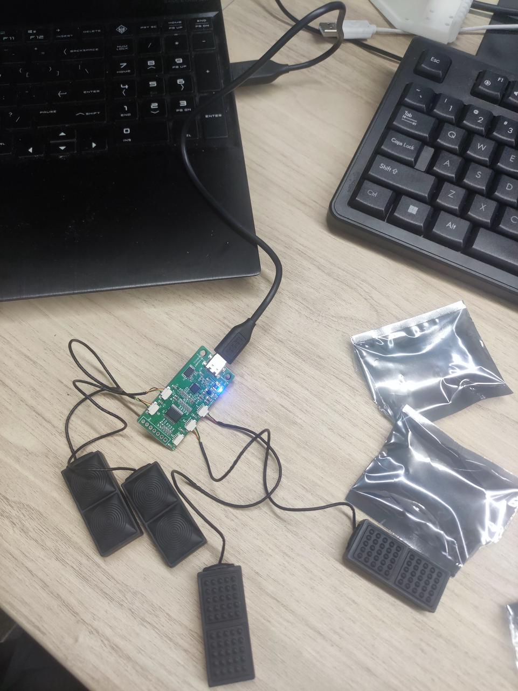
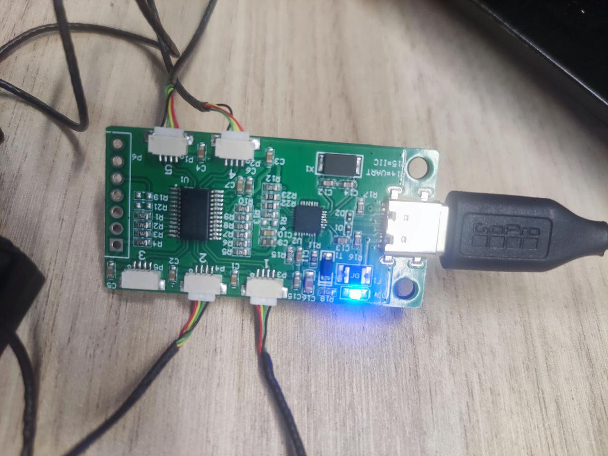
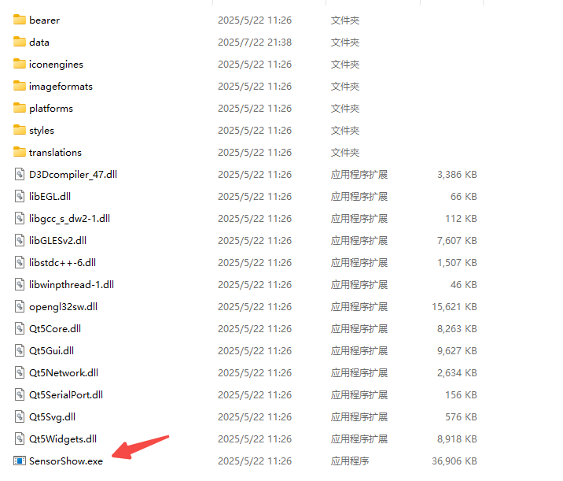
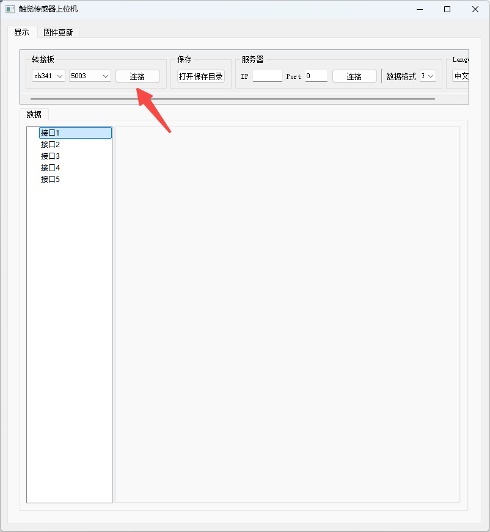
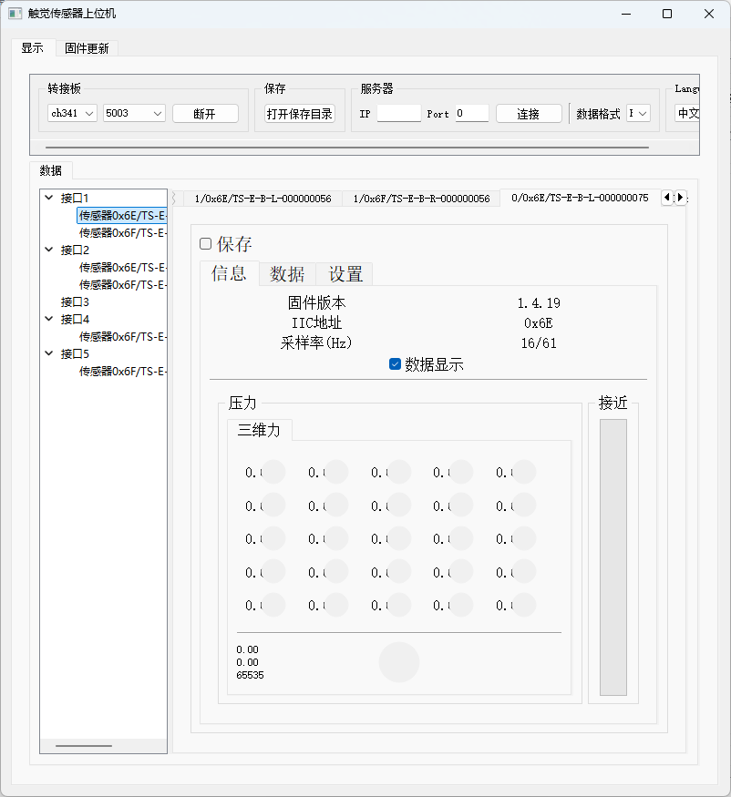
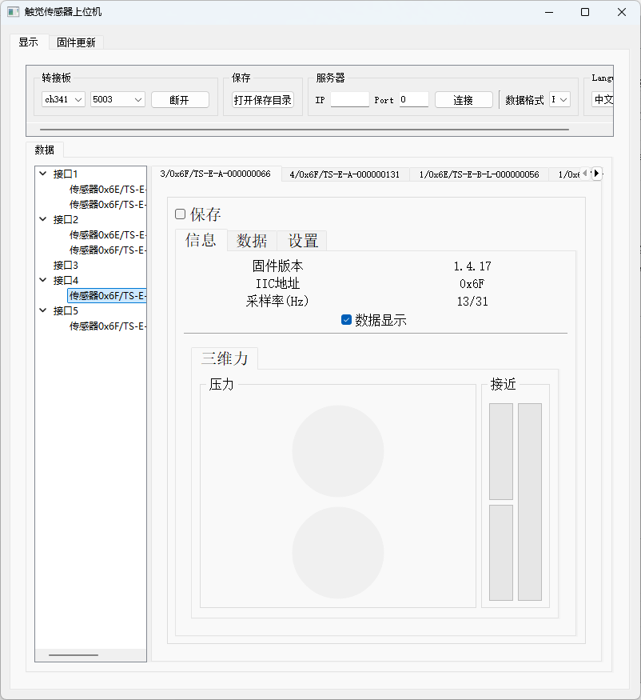

# Tashan
## Hardware Connection



## windows
### 1. CH341
下载并解压`CH341`驱动，然后安装驱动到电脑
### 2. 上位机
解压`上位机`文件夹，并点击里面的`SensorShow.exe`文件进行安装



### 3. 读取数据
注意检查`USB-C`线，线不对，会导致下方连接处`5003`位置为空







## Linux
### conda
```
conda create -n tashan python=3.9
```
### install driver
```
cd ~/Tashan/lib/ch341/CH341PAR_LINUX/driver
make
```
output
```
make -C /lib/modules/5.15.0-139-generic/build  M=/home/tars/Tashan/lib/ch341/CH341PAR_LINUX/driver  
make[1]: 进入目录“/usr/src/linux-headers-5.15.0-139-generic”
  CC [M]  /home/tars/Tashan/lib/ch341/CH341PAR_LINUX/driver/ch34x_pis.o
  MODPOST /home/tars/Tashan/lib/ch341/CH341PAR_LINUX/driver/Module.symvers
  CC [M]  /home/tars/Tashan/lib/ch341/CH341PAR_LINUX/driver/ch34x_pis.mod.o
  LD [M]  /home/tars/Tashan/lib/ch341/CH341PAR_LINUX/driver/ch34x_pis.ko
  BTF [M] /home/tars/Tashan/lib/ch341/CH341PAR_LINUX/driver/ch34x_pis.ko
Skipping BTF generation for /home/tars/Tashan/lib/ch341/CH341PAR_LINUX/driver/ch34x_pis.ko due to unavailability of vmlinux
make[1]: 离开目录“/usr/src/linux-headers-5.15.0-139-generic”
```
```
sudo make load
```
output
```
insmod ch34x_pis.ko
```
```
sudo make install
```
output
```
make -C /lib/modules/5.15.0-139-generic/build  M=/home/tars/Tashan/lib/ch341/CH341PAR_LINUX/driver  
make[1]: 进入目录“/usr/src/linux-headers-5.15.0-139-generic”
make[1]: 离开目录“/usr/src/linux-headers-5.15.0-139-generic”
insmod ch34x_pis.ko || true
insmod: ERROR: could not insert module ch34x_pis.ko: File exists
mkdir -p /lib/modules/5.15.0-139-generic/kernel/drivers/usb/misc || true
cp -f ./ch34x_pis.ko /lib/modules/5.15.0-139-generic/kernel/drivers/usb/misc/ || true
depmod -a
```
### 组权限
对于`linux`用户，需要将`ch341`添加到`udev`规则（普通用户也可以访问`ch341`设备），或者使用`sudo`权限来运行程序（不推荐）
#### 1. 将用户添加到dialout组
查看 dialout 组的成员，如果不包含当前用户则需要将用户添加到 dialout 组，`“john”`替换为你想要添加到组的用户名
```
# 查看 dialout 组的成员
getent group dialout
 
# 将用户 'john' 添加到 dialout 组
sudo usermod -a -G dialout john
```
#### 2. 创建rules文件
在 /etc/udev/rules.d/ 目录下创建一个新的规则文件
```
cd /etc/udev/rules.d/
vim ch341.rules
```
例如 `ch341.rules`，添加如下内容：
```
SUBSYSTEM=="usbmisc", ATTRS{idVendor}=="1a86", ATTRS{idProduct}=="5512", MODE="0666", GROUP="dialout"
```
`idVendor`和`idProduct`是`CH341`设备的供应商和产品ID，可以通过`lsusb`命令查找这些ID
#### 3. 更新规则文件
```
sudo udevadm control --reload-rules
sudo udevadm trigger
```
### read data
```
cd ~/Tashan
python test.py
```
output
```
2025-07-23 14:17:00.741258 [INFO] test.py -                 fingerReadHandle(16): index=0
2025-07-23 14:17:00.741368 [INFO] test.py -                 fingerReadHandle(17): capChannelDat=[3344676, 3211020, 3448990, 3316090, 3169310, 3144096, 3242934, 3257274, 3156132, 3226344, 3501068, 3366284, 3241568, 3445638, 3930848, 8256280]
2025-07-23 14:17:00.741397 [INFO] test.py -                 fingerReadHandle(19): nf[0] = 0.0
2025-07-23 14:17:00.741421 [INFO] test.py -                 fingerReadHandle(20): tf[0] = 0.0
2025-07-23 14:17:00.741445 [INFO] test.py -                 fingerReadHandle(21): tfDir[0] = 65535
2025-07-23 14:17:00.741465 [INFO] test.py -                 fingerReadHandle(19): nf[1] = 0.0
2025-07-23 14:17:00.741491 [INFO] test.py -                 fingerReadHandle(20): tf[1] = 0.0
2025-07-23 14:17:00.741512 [INFO] test.py -                 fingerReadHandle(21): tfDir[1] = 65535
2025-07-23 14:17:00.741532 [INFO] test.py -                 fingerReadHandle(22): sProxCapData = [0, 0]
2025-07-23 14:17:00.741557 [INFO] test.py -                 fingerReadHandle(23): mProxCapData = [0]
```
* capChannelDat为电容通道原始值
* nf、tf、tfDir分别为一组三维力的法向力、切向力和切向力方向
* sProxCapData为自电容接近值
* mProxCapData为互电容接近值

## 连接手指数量设定
手指连接板最大支持5个传感器连接，不足5个传感器连接会影响读取频率，可以修改如下宏定义配置连接数量：
```
DEF_MAX_FINGER_NUM = 2 # 需要连接的手指数量，最大5个
```