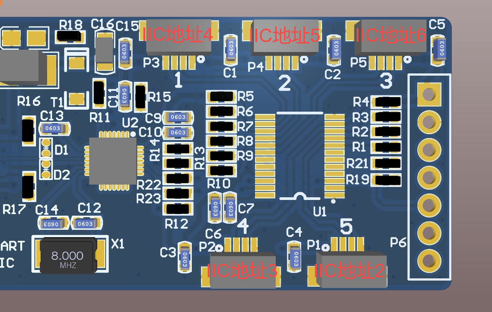

# 他山触觉传感器python(64bit)demo

此demo为他山触觉传感器python（64bit）demo，可以读取传感器的通道原始值和三维力值

# Getting started

## 安装ch341驱动

### windows
直接运行CH341PAR.exe，按照提示安装

### linux

按照“CH341PAR_LINUX”文件夹下的“README.md"安装驱动

## linux下环境搭建
对于linux用户，需要将ch341添加到udev规则（普通用户也可以访问ch341设备），或者使用sudo权限来运行程序（不推荐）

### 将用户添加到dialout组
查看 dialout 组的成员，如果不包含当前用户则需要将用户添加到 dialout 组，“john”替换为你想要添加到组的用户名
```
# 查看 dialout 组的成员
getent group dialout
 
# 将用户 'john' 添加到 dialout 组
sudo usermod -a -G dialout john
```
### 创建rules文件
在 /etc/udev/rules.d/ 目录下创建一个新的规则文件，例如 ch341.rules，添加如下内容：
```
SUBSYSTEM=="usbmisc", ATTRS{idVendor}=="1a86", ATTRS{idProduct}=="5512", MODE="0666", GROUP="dialout"
```
idVendor和idProduct是CH341设备的供应商和产品ID，可以通过lsusb命令查找这些ID
### 更新规则文件
```
sudo udevadm control --reload-rules
sudo udevadm trigger
```

# 运行示例

## 上电
传感器不同版本的固件上电时间存在差异，建议在传感器上电3s后再运行读取程序
## demo根目录下运行如下命令执行程序
```
python test.py
```
程序运行结果：
```
capChannelDat=[3020838, 3006548, 2986382, 2929380, 2995152, 2992100, 2988970, 2996232, 2904946, 2947736, 2895000, 2842188, 2999608, 2922258, 2776718, 7950022]
nf[0] = 0.0
tf[0] = 0.0
tfDir[0] = 0
nf[1] = 0.0
tf[1] = 0.0
tfDir[1] = 0
sProxCapData[0] = 0
sProxCapData[1] = 0
mProxCapData[0] = 0
```
* capChannelDat为电容通道原始值
* nf、tf、tfDir分别为一组三维力的法向力、切向力和切向力方向
* sProxCapData为自电容接近值
* mProxCapData为互电容接近值

## 连接手指数量设定
手指连接板最大支持5个传感器连接，不足5个传感器连接会影响读取频率，可以修改如下宏定义配置连接数量：
```
DEF_MAX_FINGER_NUM = 2 # 需要连接的手指数量，最大5个
```
## iic接口顺序和iic地址定义
此demo中的iic地址和插入转接板的接口位置是固定对应关系，iic地址和iic接口顺序对照关系如下：

  
如果插入的传感器和对应接口的iic地址不同，在初始化阶段会强制将传感器的iic地址设置为图中对应的地址：
```
def checkSensor(self):
    # 广播的方式读取当前传感器地址，并默认将iic地址配置为和pca相同的地址
    addrRead = self.snsCmd.getAddr(0) 
    if addrRead != self.pcaIdx:
        if self.pcaIdx != self.snsCmd.setAddr(addrRead, self.pcaIdx):
            logger.error(f"set addr false, setaddr={self.pcaIdx}")
            return False
        else:
            addrRead = self.pcaIdx
            logger.info(f"update iic addr, new addr ={addrRead}")
```
